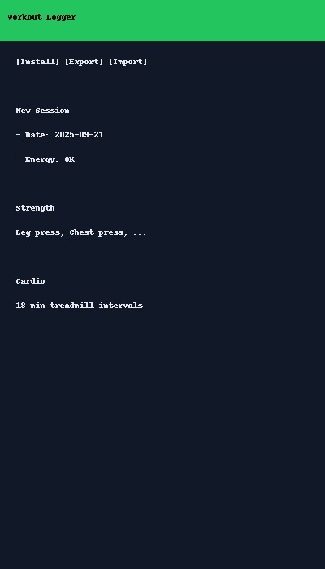
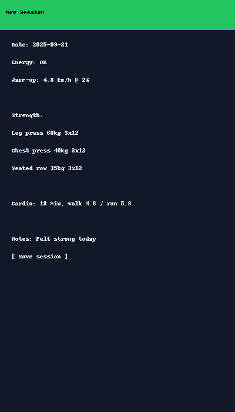
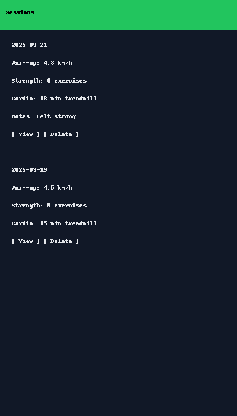

# 🏋️ Workout Logger (PWA)

En enkel treningslogger laget som en **Progressive Web App (PWA)**.  
Fungerer direkte i nettleseren på mobil/PC, kan installeres som app, og lagrer data **offline** på enheten din.

---

## 🚀 Bruk

1. Gå til siden:  
   ```
   https://<ditt-brukernavn>.github.io/workout-logger/
   ```
2. Åpne i **Chrome/Edge/Safari** på mobil eller PC.  
3. Velg **Legg til på Hjem-skjerm** / **Install app** for å få den som en egen app.  
4. Treningsøktene lagres lokalt (ingen server). Du kan eksportere/importere JSON eller CSV.

---

## 📋 Funksjoner

- ✍️ **Logg økter**: Oppvarming, styrkeøvelser, kondisjon og notater.  
- 💾 **Lagring**: Alt lagres i nettleseren (LocalStorage).  
- 📤 **Eksport**: Last ned alle økter som JSON eller CSV.  
- 📥 **Import**: Hent inn tidligere økter fra JSON-fil.  
- 📱 **Offline-first**: Fungerer uten nett (Service Worker).  
- 🖥️ **Installér som app**: Full PWA-støtte med ikon og offline-cache.

---

## 📦 Teknologi

- HTML, CSS, JavaScript  
- Service Worker for offline-cache  
- Manifest for PWA-installasjon  
- LocalStorage for lagring av økter  

---

## 📸 Skjermbilder

**Startskjerm**  


**Ny økt**  


**Liste over økter**  


---

## ⚙️ Lokal kjøring

Hvis du vil teste lokalt før du laster opp:

```bash
python -m http.server 8000
```

Åpne [http://localhost:8000](http://localhost:8000) i nettleseren.

---

## 👨‍👩‍👦 Deling

Du kan dele lenken med andre (f.eks. familiemedlemmer), og de får samme app.  
⚠️ Merk: Data lagres lokalt på hver enhet, ikke i skyen.

---

## 📝 Lisens

Fritt å bruke, endre og dele.
